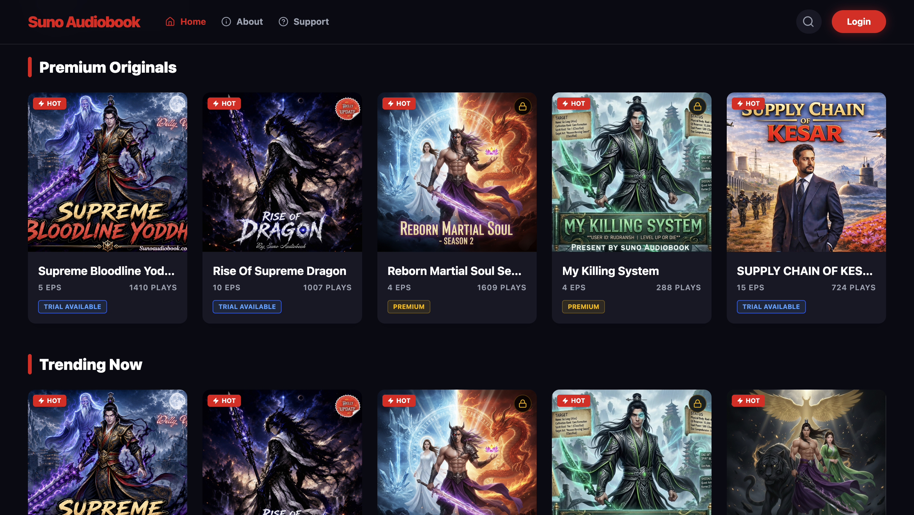
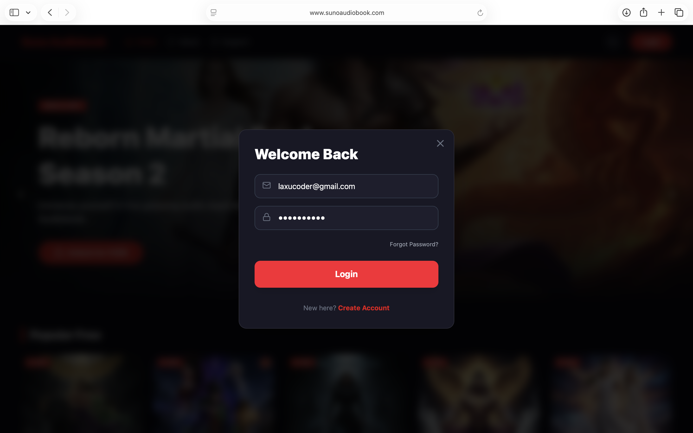
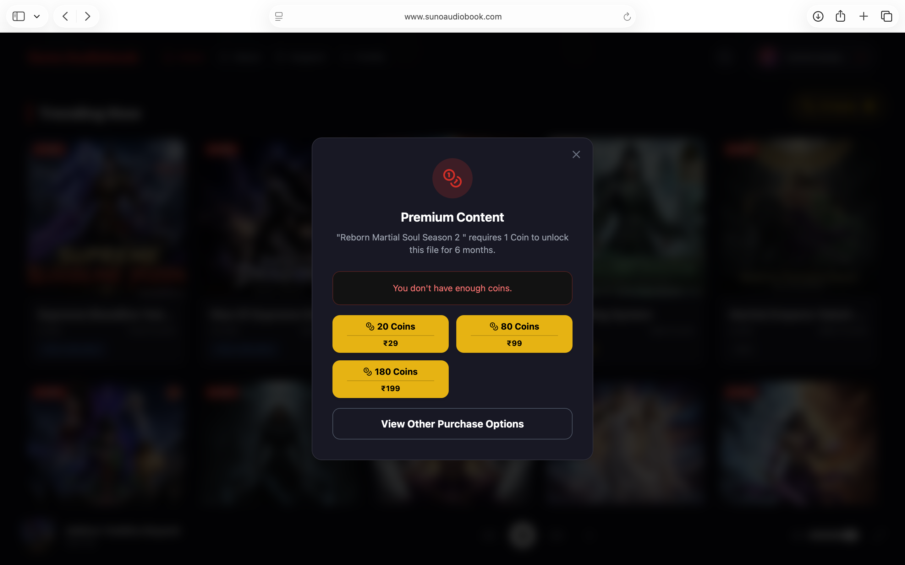

# 🎧 Suno Audiobook

<p align="center">
  
</p>

<h3 align="center">
  🎧 Listen. 📖 Imagine. ✨ Experience.
</h3>

<p align="center">
  A modern full-stack audiobook and storytelling platform built to deliver an immersive digital listening experience.
</p>

<p align="center">
  <a href="https://www.sunoaudiobook.com">🌐 Live Website</a>
  •
  <a href="https://github.com/laxucoder">💻 GitHub</a>
</p>

---

## 📖 About

**Suno Audiobook** is a modern audiobook and storytelling platform created to make digital storytelling more immersive, accessible, and enjoyable.

The platform allows users to explore audiobooks, listen to episodes through an integrated audio player, manage their accounts, and access premium content through a coin-based purchasing system.

I built Suno Audiobook as a real-world full-stack project to bring together **frontend development, backend engineering, authentication, audio streaming, payment integration, email services, user management, and production deployment** in one complete platform.

🚀 What started as an idea became a complete web product focused on delivering a smooth and engaging audiobook experience.

---

## ✨ Features

### 🎧 Audiobook Experience

- 📚 Browse available audiobooks and stories
- 🎵 Built-in audiobook player
- ⏭️ Episode navigation
- 📋 Current playback queue
- ▶️ Play, pause and resume listening
- 🔊 Audio volume controls
- ⚡ Smooth listening experience

### 🔐 Authentication

- 👤 User registration and login
- 🔒 Secure authentication
- 📧 Email-based account services
- 🔑 Password recovery
- 👤 User profile management

### 💎 Premium Content

- 🔐 Premium audiobook episodes
- 🪙 Coin-based content unlocking
- 💰 Multiple coin packages
- 📅 Content access period management
- ⚡ Instant premium access after successful purchase

### 💳 Payments

- 💳 Online payment integration
- 🪙 Coin purchasing system
- 🧾 Transaction-based access
- 🔐 Secure payment workflow

### 📧 Email Services

- 📩 Automated email communication
- 🔐 Authentication-related emails
- 📬 User notifications
- ⚡ Transaction-related communication

### 📊 Platform Management

- ⚙️ Admin functionality
- 📚 Audiobook/content management
- 👥 User management
- 📈 Platform monitoring and analytics

### 📱 User Experience

- 🌙 Modern dark interface
- 📱 Responsive design
- ⚡ Fast navigation
- 🎨 Clean and immersive UI
- 🖥️ Desktop-friendly experience
- 📲 Mobile-friendly interface

---

# 📸 Project Preview

## 🏠 Homepage

The homepage provides users with a cinematic introduction to the platform, featured stories, popular content, and quick access to audiobooks.

<p align="center">
  
</p>

---

## 🔐 Login

Users can securely access their accounts through the authentication system.

<p align="center">
  
</p>

---

## 🎧 Audiobook Player

The audiobook player provides an immersive listening experience with episode navigation and a current playback queue.

<p align="center">
  
</p>

---

## 💳 Premium Content & Coin System

Premium stories can be unlocked using the platform's coin system.

Users can purchase different coin packages and use their balance to access premium audiobook content.

<p align="center">
  
</p>

---

# 🛠️ Technology Stack

### Frontend


### Backend


### Database


### Services & Infrastructure


### Development


---

# 🏗️ Platform Architecture

Suno Audiobook follows a full-stack architecture where the frontend communicates with the backend through APIs.

```text
                    ┌─────────────────────┐
                    │      User 👤        │
                    └──────────┬──────────┘
                               │
                               ▼
                    ┌─────────────────────┐
                    │   React Frontend    │
                    │      🎨 UI/UX       │
                    └──────────┬──────────┘
                               │
                         REST APIs
                               │
                               ▼
                    ┌─────────────────────┐
                    │   Node.js +         │
                    │   Express Backend   │
                    └──────────┬──────────┘
                               │
              ┌────────────────┼────────────────┐
              │                │                │
              ▼                ▼                ▼
        ┌───────────┐   ┌────────────┐   ┌────────────┐
        │ Database  │   │ Payments   │   │   Email    │
        │    🗄️     │   │    💳      │   │    📧      │
        └───────────┘   └────────────┘   └────────────┘
                               │
                               ▼
                       Premium Content
                              🎧
